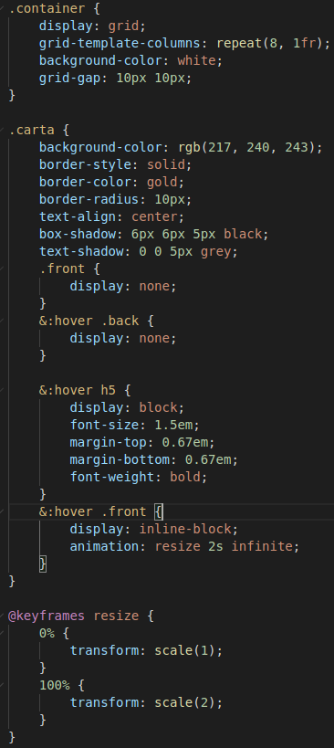
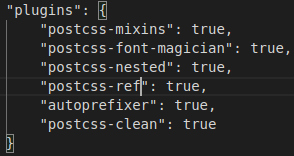
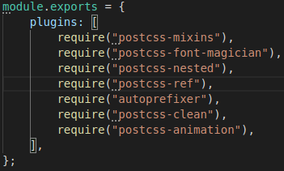
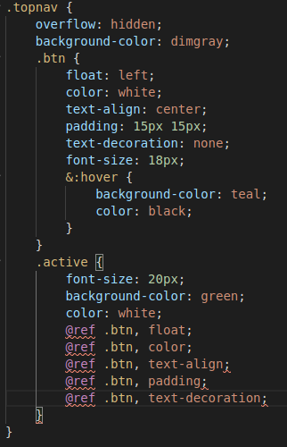
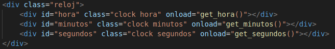
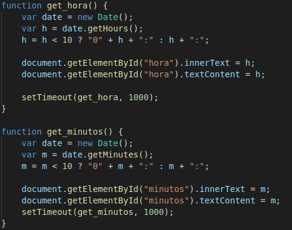
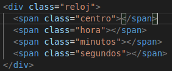
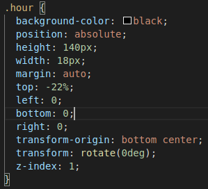
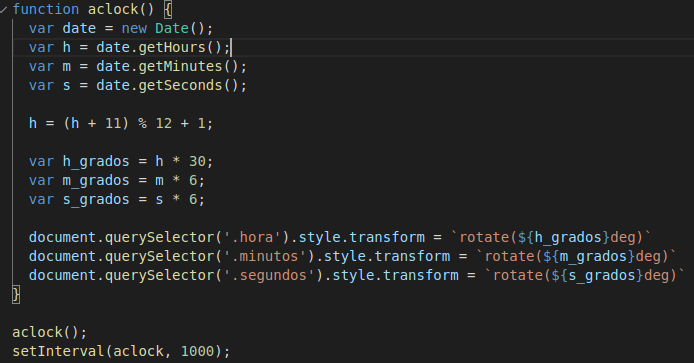

## dsi-p4-pokedex-alu0100658705

## Pablo Bethencourt Díaz

## alu0100658705@ull.edu.es

### Práctica 4: PokeDex

1. **Crea una página donde se muestren todos los pokémon de la primera generación en un elemento HTML, donde en su interior aparezca la imagen del mismo, su ID y su nombre. Utiliza PostCSS para darle estilos y adaptarlos para que parezca una tarjeta o carta.**

Se ha implementado un fichero HTML de inicio con un elemento _div_ que contiene todas las cartas que se irán creando a partir de los ficheros JSON de cada Pokemon, para ello se define una función asíncrona _getPokemon_ que retorna una promesa: en la función se implementa un bucle que va accediendo al JSON de cada Pokemon mediante _fetch_ que recupera la información del documento, con esa información se crea un objeto _Pokemon_ con los parámetros requeridos en la práctica. Cada objeto instanciado se guarda de forma ordenada en un vector, para garantizar que se respeta el orden númerico de los Pokemons.

Luego se llama a la función _generatePokedex_ que define los distintos elementos HTML que conforman cada carta.

Estructura de la clase _Pokemon_:

2. **Modifica el ejemplo de modo que todos los pokemon se vean de espaldas y cuando pases el ratón por encima de ellos, se muestren de frente. ¿Serías capaz también de conseguir aumentar su tamaño mediante CSS? ¿Que propiedad tendrías que utilizar? ¿Encuentras alguna forma de mantener el pixelado de la imagen sin que se vea borrosa?**

El código implementado ha sido el siguiente:

Para aumentar su tamaño se ha empleado la siguiente animación:

No obstante, se podría haber utilizado simplemente la propiedad **transform** con el parámetro _scale_, para darle el tamaño deseado dentro de los estilos del objeto, sin necesidad de emplear la animación. También se puede hacer uso de **zoom**. Como en el tema se han explicado las animaciones, se ha considerado conveniente emplearlas para esta práctica.

Trás una búsqueda exhaustiva, no se ha conseguido encontrar la forma de evitar que la imagen pierda calidad cuando aumenta su tamaño.

3. **La forma más fácil de hacer los puntos anteriores es utilizar los recursos de forma local o teniendo un JSON en local con toda la información. Sin embargo, la idea de esta práctica es obtener la información desde la API de PokéAPI realizando peticiones desde Javascript y obteniendo la información necesaria. Asegúrate que lo estás haciendo así y comprueba que el orden de los pokémon es el correcto (ordenados, de menor a mayor). Pista: Las promesas y Promise.all() podría ayudarte.**

Se han utilizado promesas.

### Retos:

1. **Busca plugins de PostCSS que consideres interesantes y documentalos en el README.md con un enlace a su GitHub y una breve descripción de lo que hacen y para que podría serte útil.**

El plugin que se ha seleccionado ha sido **postcss-ref**. Este plugin permite referenciar propiedades de otras reglas de estilos, definidas en otros elementos, para evitar tener que definirlas nuevamente.

Para instalar el plugin: _npm install postcss-ref_

Lo añadimos a los ficheros de configuración de PostCSS:

En este caso, se ha utilizado para reutilizar las reglas de estilo de los botones de la barra de navegación en función de si el elemento pertenece a la clase _active_ o no. Para referenciar los elementos se utiliza la regla _@ref_. Veamos el código:

Enlace a [GitHub](https://github.com/morishitter/postcss-ref)

2. **Digital Clock: Reto fácil. Implementa un reloj digital que muestre la hora actual. Para conseguir el relleno izquierdo de los ceros, investiga el método .padStart().**

Implementada. Se ha creado una clase _reloj_ con tres elementos hijo, uno para cada uno de los componentes del reloj (hora, minutos y segundos) para trabajar con _Flexbox_. La estructura del fichero html es la siguiente:

En el fichero JavaScript se ha definido una función para cada elemento, aunque escencialmente su implementación y funcionamiento es el mismo para cada uno:

Contenido del fichero css utilizando _Flexbox_:

3. **Analogic Clock: Reto difícil. Implementa un reloj analógico que muestre la hora real · Previsualización**

Se implementa un nuevo fichero html con los componentes del reloj analógico:

Para mover las manecillas del reloj se utiliza la transformación _rotate()_ para que giren alrededor del elemento centro:

En el archivo JavaScript se define una función similar a la implementada para el reloj digital, donde se toman los elementos hora, donde se debe corregir el valor para que este en formato PM o AM (es decir que sea un valor entre 1-12), minutos y segundos. Luego se toman los grados que se van a rotar cada elemento: al ser 12 horas se multiplica el valor hora por 30 (12x30 = 360), y minutos y segundos por 6 (60x6 = 360). Luego los valores de los grados se actualizan para cada uno de los elementos:

